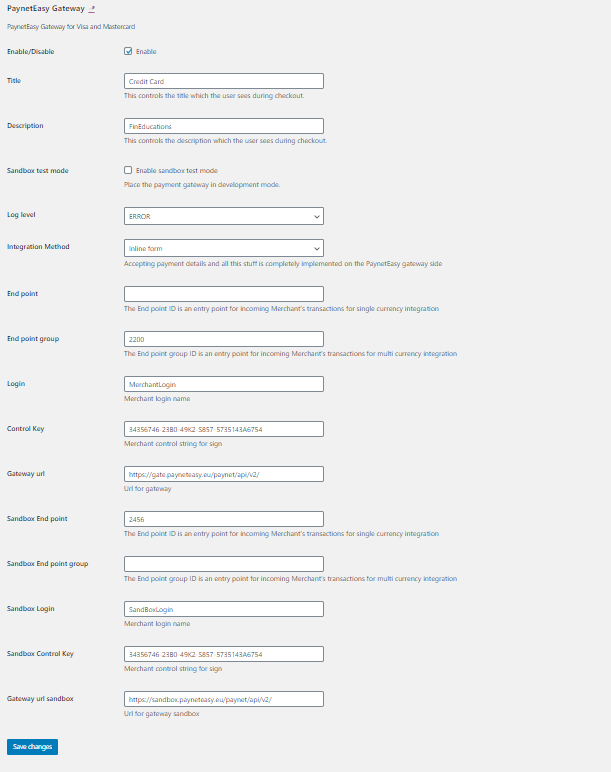

Installation process:

1. Install WordPress
2. Install woocommerce
3. In the folder <Your site WP root>/wp-content/plugins/ create directory "paynet-easy-gateway"
4. Copy repository code to the folder <Your site WP root>/wp-content/plugins/paynet-easy-gateway/
5. Login to admin WP panel: http://woocommerce/wp-admin/plugins.php - plugins
6. Find and activate plugin with name "PaynetEasy Gateway" (if there is no problem, it will pass activation)
7. Go to the page: Woocommerce/Settings, Payments tab: http://woocommerce/wp-admin/admin.php?page=wc-settings&tab=checkout
8. On this page activate and customize PaynetEasy Gateway plugin:
http://woocommerce/wp-admin/admin.php?page=wc-settings&tab=checkout&section=payneteasy
according to the interface data (all settings are described and understandable)
9. Make a test payment.

Процесс установки:

1. Установить WordPress
2. Установить woocommerce
3. В папке <Ваш корень сайта WP>/wp-content/plugins/ создать директорию "paynet-easy-gateway"
4. В папку <Ваш корень сайта WP>/wp-content/plugins/paynet-easy-gateway/ скопировать код репозитория
5. Зайти в административную панель WordPress, меню плагинов: http://woocommerce/wp-admin/plugins.php
6. Найти там плагин с именем PaynetEasy Gateway, активировать его (если проблем нет, он активируется)
7. Зайти на страницу: Woocommerce/Настройки, вкладка Платежи: http://woocommerce/wp-admin/admin.php?page=wc-settings&tab=checkout
8. Найти там плагин PaynetEasy Gateway, включить его и настроить согласно данных интерфейса: http://woocommerce/wp-admin/admin.php?page=wc-settings&tab=checkout&section=payneteasy
9. Сделать тестовый платёж

An example of configured settings/Пример настроенной конфигурации

